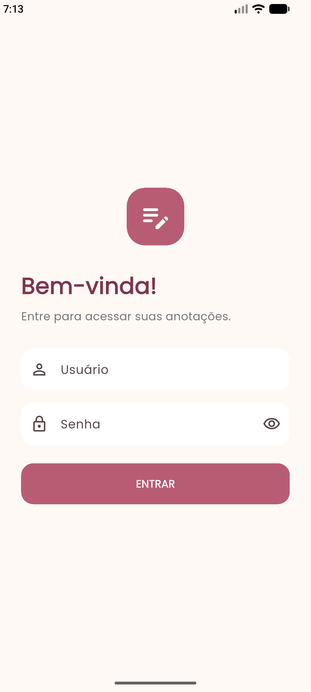
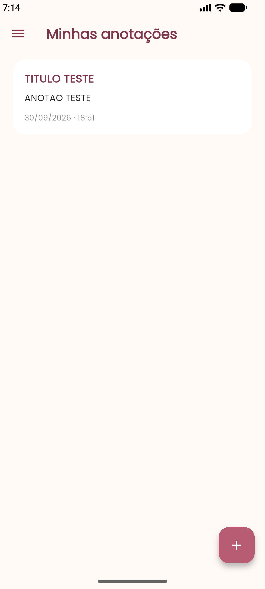
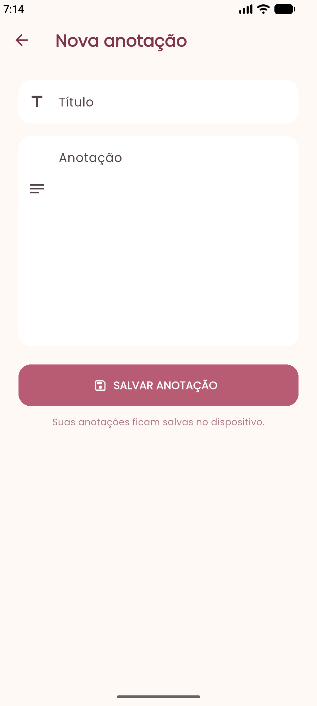
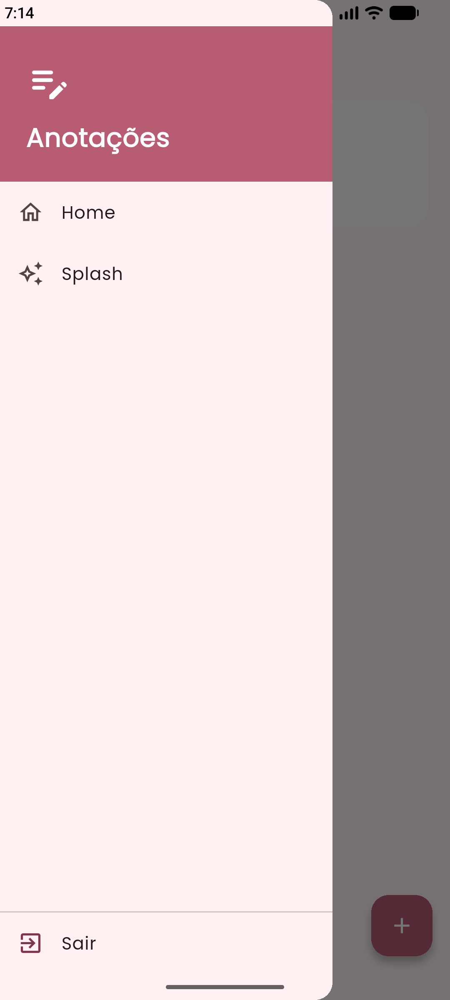

#  Bloco de Anotações

Aplicativo mobile desenvolvido em **Flutter** para o **Desafio 03 — Aula 04: Consumo de APIs Externas**, da disciplina de Programação para Dispositivos Móveis.

O aplicativo é um bloco de anotações com autenticação através da API **DummyJSON** e armazenamento local das anotações no dispositivo.

---

## ✦ Funcionalidades

###  Autenticação
- Login utilizando a API DummyJSON
- Autenticação através de `username` e `password`
- Validação das credenciais
- Mensagem de acesso negado quando o login não é realizado

###  Anotações
- Visualização das anotações cadastradas
- Criação de novas anotações
- Registro da data e horário
- Armazenamento local no dispositivo
- Recuperação das anotações após fechar e abrir o aplicativo

###  Navegação
- Splash Screen com animação de entrada e saída
- Tela de Login
- Tela Home
- Menu lateral
- Acesso à Splash através do menu
- Opção para sair do aplicativo
- Botão `+` para criar uma nova anotação

---

##  Interface

O aplicativo possui uma interface simples e intuitiva, com uma identidade visual baseada em tons de rosa e creme.

### Splash Screen


### Login



### Home



### Nova anotação



### Menu lateral


---

##  Tecnologias

| Tecnologia | Utilização |
|---|---|
| Flutter | Desenvolvimento do aplicativo |
| Dart | Linguagem de programação |
| DummyJSON | Autenticação |
| SharedPreferences | Persistência local |
| Google Fonts | Fonte da interface |
| Android Studio | Emulação e execução |
| VS Code | Desenvolvimento |

---

##  API

A autenticação é realizada através da API **DummyJSON**.

O aplicativo envia:

- `username`
- `password`

para realizar a autenticação.

Após uma autenticação bem-sucedida, o usuário é direcionado para a tela Home.

Em caso de credenciais inválidas, o aplicativo informa que o acesso foi negado.

---

##  Persistência

As anotações são armazenadas localmente utilizando o pacote **SharedPreferences**.

Isso permite que as anotações continuem disponíveis mesmo depois que o aplicativo é fechado e aberto novamente no dispositivo.

---

## 📂 Estrutura do projeto

```text
lib/
├── main.dart
├── splash_screen.dart
├── login_screen.dart
├── home_screen.dart
├── anotacao_screen.dart
├── auth_service.dart
└── storage_service.dart
```
## Como executar
Pré-requisitos

É necessário ter instalado:

Flutter
Dart
Android Studio ou VS Code
Emulador Android ou dispositivo Android
Instalação

Clone o repositório:

git clone "https://github.com/biaams-sys/flutter__desafio_anotacoes.git"

Entre na pasta do projeto:

cd flutter_desafio_anotacoes

Instale as dependências:

flutter pub get

Execute o aplicativo:

flutter run
 Usuário para teste

Para testar a autenticação, pode ser utilizado o usuário disponibilizado pela API DummyJSON:

Usuário: emilys
Senha: emilyspass
Você colou o bloco **dentro de um bloco de código**, por isso o GitHub está tratando tudo como código. 😭

**Não apague o README inteiro.** Só substitua a parte final por este conteúdo **exatamente como está abaixo**, começando em `## 📦 APK`:

````md
##  APK

A versão final do aplicativo foi gerada em modo Release:

```bash
flutter build apk --release
````

### Download

[ Baixar APK — app-release.apk](./app-release.apk)

---

##  Desafio

**Aula 04 — Consumo de APIs Externas**

**Desafio 03 — Aplicativo de bloco de anotações**

Projeto desenvolvido para a disciplina de **Programação para Dispositivos Móveis — SENAI**.

---

## 👩‍💻 Autora

**Beatriz Albuquerque**


Beatriz Albuquerque - biaams-sys
